

  🎉 Feel free to choose a homepage template for your project that you like. 🎉

---

#### 0.Nerfies

- Link: https://github.com/nerfies/nerfies.github.io
- Preview: https://nerfies.github.io/

    
Screeshot

  
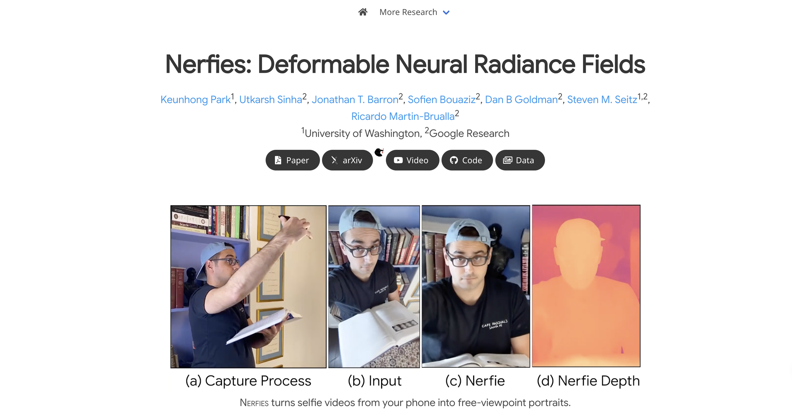

---

#### 1.Academic Project Page (Support `poster`)

- Link: https://github.com/eliahuhorwitz/Academic-project-page-template
- Preview: https://eliahuhorwitz.github.io/Academic-project-page-template/

    
Screeshot

  
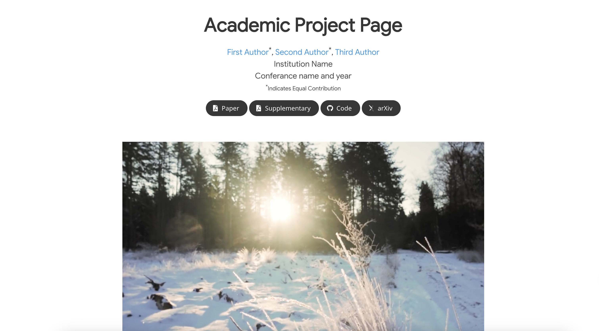

---

#### 2.academic-project-page-template-vue

- Link: https://github.com/JunyaoHu/academic-project-page-template-vue
- Preview: https://junyaohu.github.io/academic-project-page-template-vue/

    
Screeshot

  
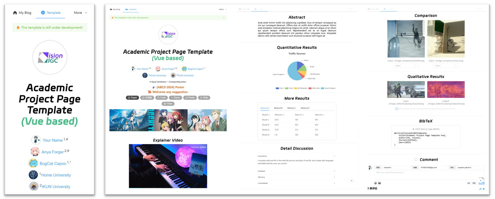

---

#### 3.MiniGPT-4 Homepage (A simplified version of Nerfies)

- Link: https://github.com/minigpt-4/minigpt-4.github.io
- Preview: https://minigpt-4.github.io/

    
Screeshot

  
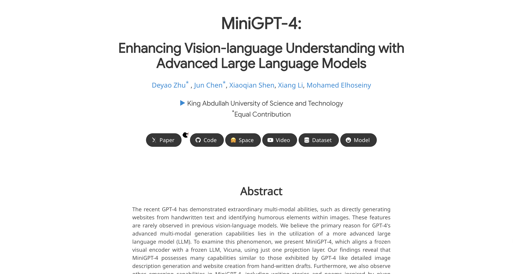

---

#### 4.LLaVA Homepage (Support `Gradio Demo`)

- Link: https://github.com/LLaVA-VL/llava-vl.github.io ([other version](https://t2v-turbo.github.io/))
- Preview: https://llava-vl.github.io/

    
Screeshot

  
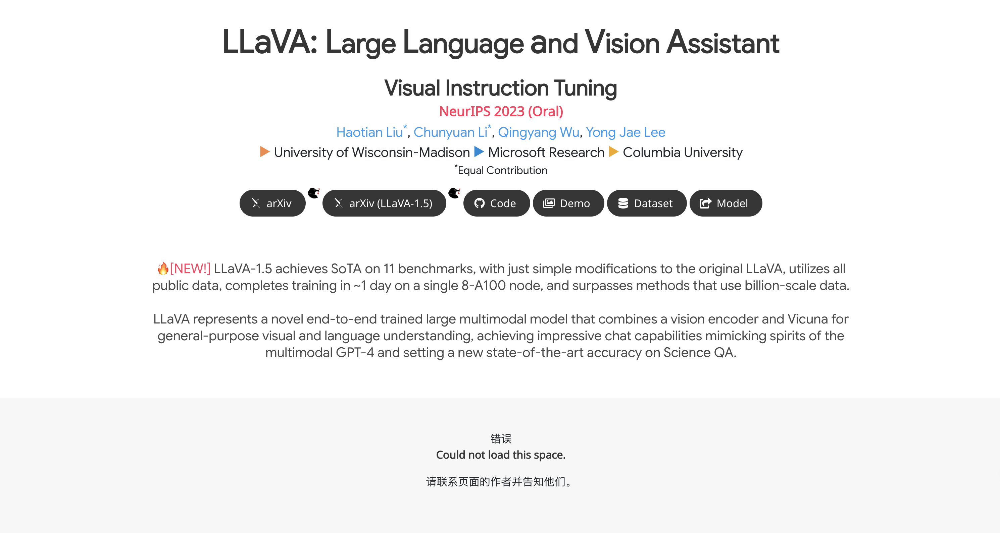

---

#### 5.BiomedParse Homepage (Supports `scrollable images` and `dynamic segmentation`)

- Link: https://github.com/microsoft/BiomedParse/tree/project_page
- Preview: https://microsoft.github.io/BiomedParse/

    
Screeshot

  
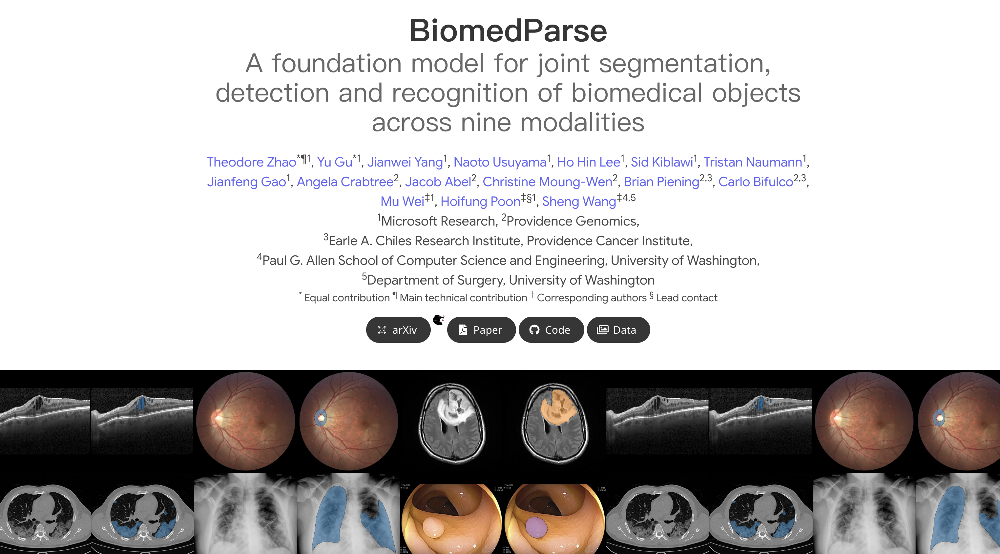

---

#### 6.Show-1 Homepage

- Link: https://github.com/showlab/Show-1/tree/page
- Preview: https://showlab.github.io/Show-1/

    
Screeshot

  
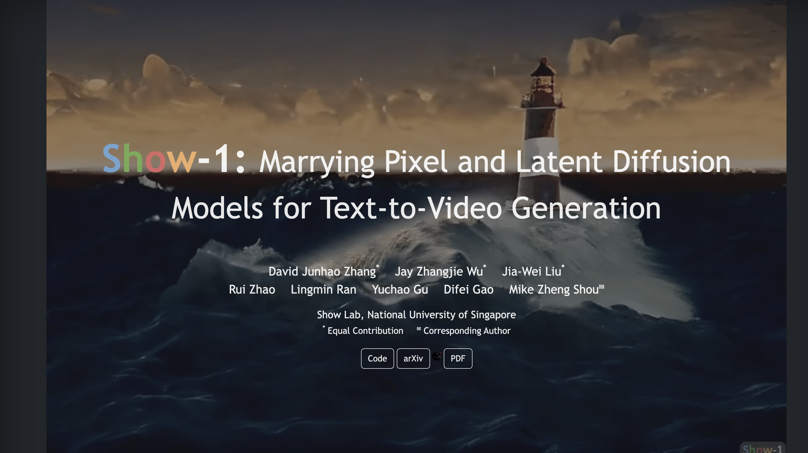

---

#### 7.OLA-VLM Homepage

- Link: None
- Preview: https://praeclarumjj3.github.io/ola_vlm/

    
Screeshot

  
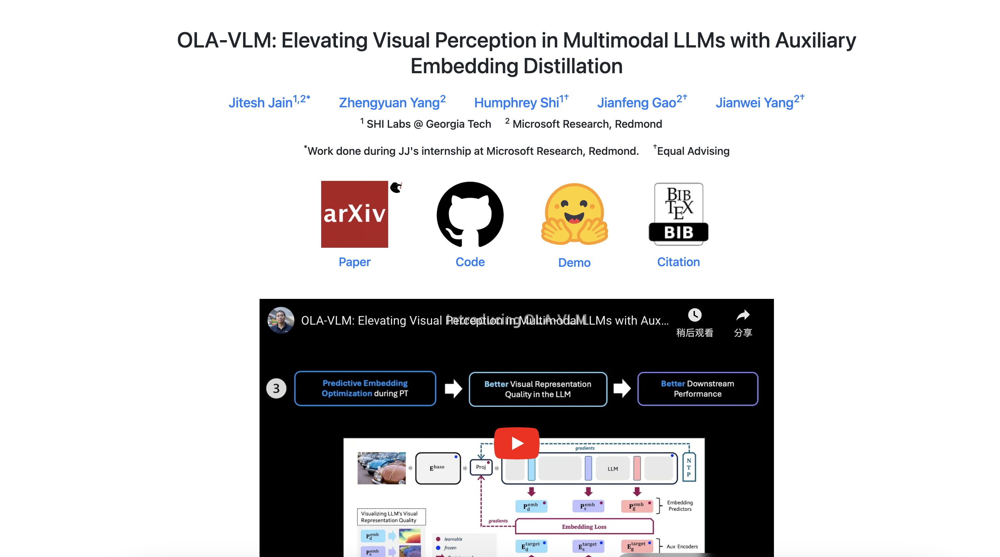

---

#### 8.Video-MME Homepage (Support `splash screen animation`)

- Link: https://video-mme.github.io/
- Preview: https://github.com/Video-MME/video-mme.github.io

    
Screeshot

  
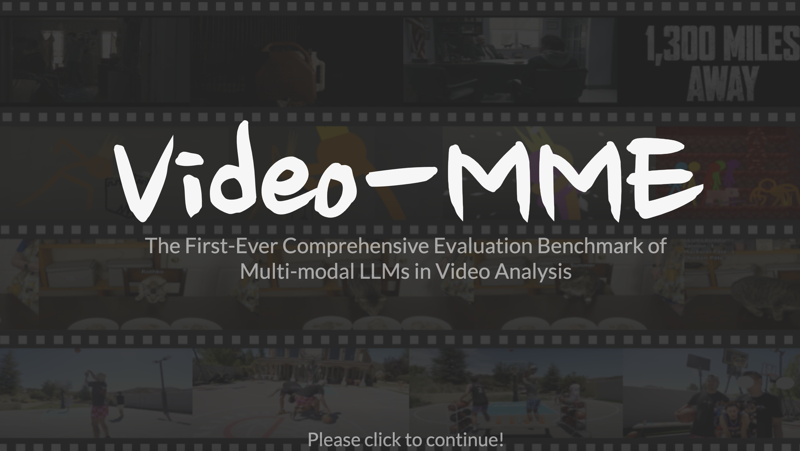

---

#### 9.F5-TTS Homepage

- Link: https://github.com/SWivid/SWivid.github.io/tree/main/F5-TTS
- Preview: https://swivid.github.io/F5-TTS/

    
Screeshot

  
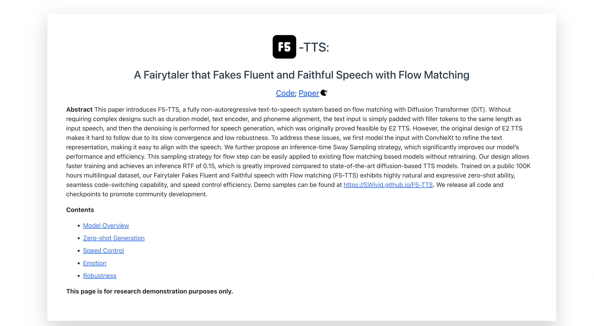

---

#### 10.Genesis Homepage (Support `logo`)

- Link: https://github.com/Genesis-Embodied-AI/genesis-embodied-ai.github.io
- Preview: https://genesis-embodied-ai.github.io/

    
Screeshot

  
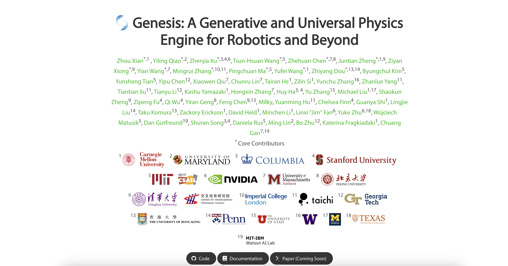

---

#### 11.MLLM Projections Homepage

- Link: https://github.com/claws-lab/projection-in-MLLMs
- Preview: https://claws-lab.github.io/projection-in-MLLMs/

    
Screeshot

  
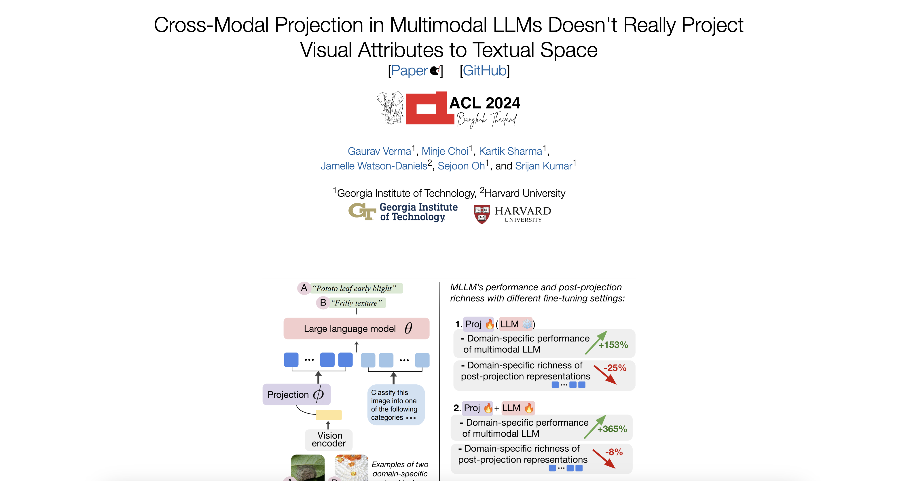

---
