

  🎉 Feel free to choose a homepage template for your project that you like. 🎉

---

#### 0.Nerfies

- Link: https://github.com/nerfies/nerfies.github.io
- Preview: https://nerfies.github.io/

    
Screeshot

  
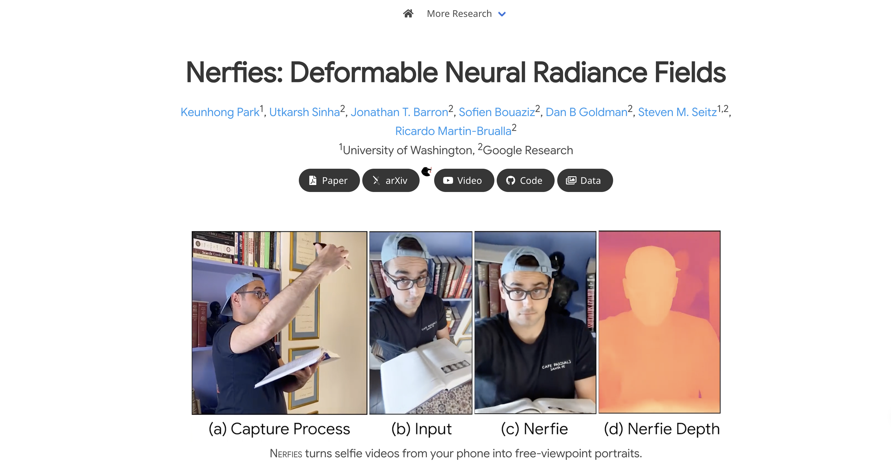

---

#### 1.Academic Project Page (Support `poster`)

- Link: https://github.com/eliahuhorwitz/Academic-project-page-template
- Preview: https://eliahuhorwitz.github.io/Academic-project-page-template/

    
Screeshot

  
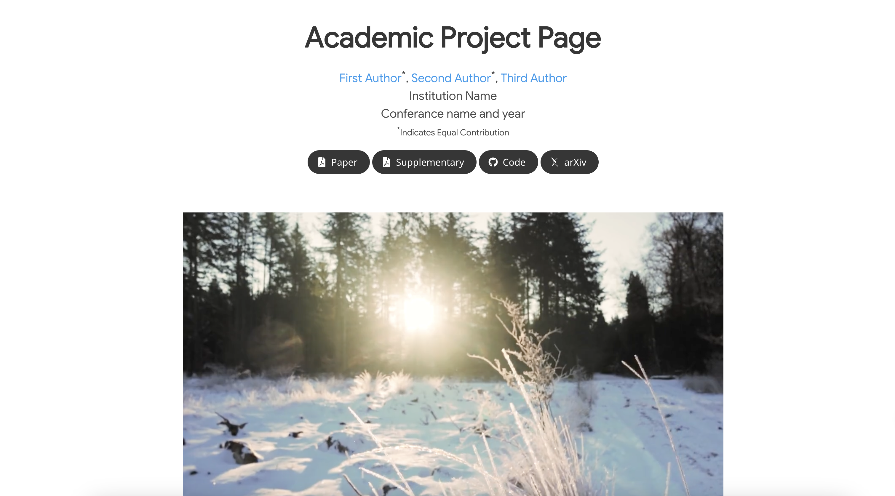

---

#### 2.academic-project-page-template-vue

- Link: https://github.com/JunyaoHu/academic-project-page-template-vue
- Preview: https://junyaohu.github.io/academic-project-page-template-vue/

    
Screeshot

  
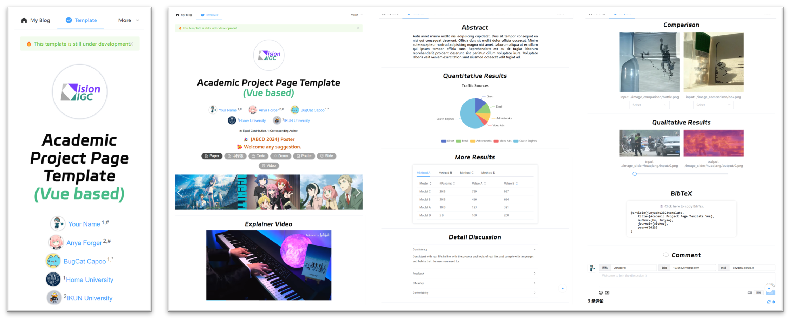

---

#### 3.MiniGPT-4 Homepage (A simplified version of Nerfies)

- Link: https://github.com/minigpt-4/minigpt-4.github.io
- Preview: https://minigpt-4.github.io/

    
Screeshot

  
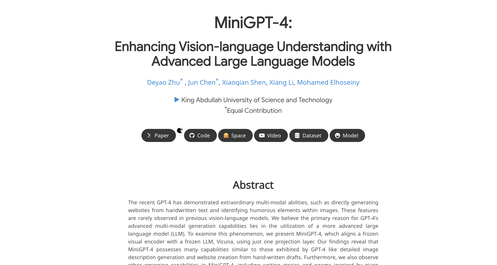

---

#### 4.LLaVA Homepage (Support `Gradio Demo`)

- Link: https://github.com/LLaVA-VL/llava-vl.github.io ([other version](https://t2v-turbo.github.io/))
- Preview: https://llava-vl.github.io/

    
Screeshot

  
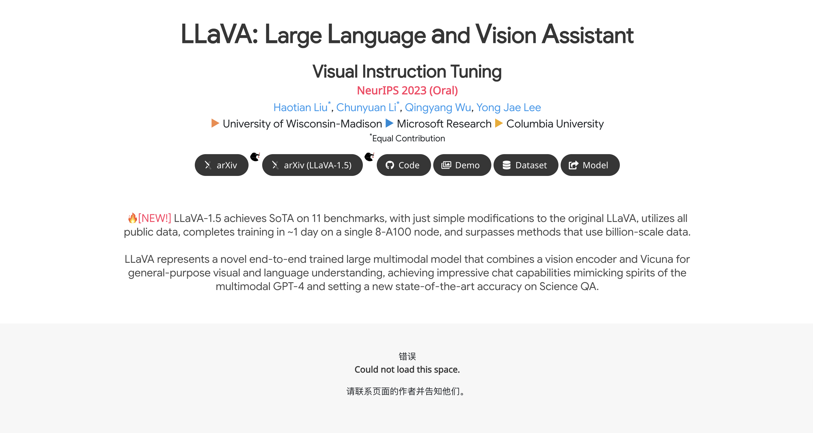

---

#### 5.BiomedParse Homepage (Supports `scrollable images` and `dynamic segmentation`)

- Link: https://github.com/microsoft/BiomedParse/tree/project_page
- Preview: https://microsoft.github.io/BiomedParse/

    
Screeshot

  
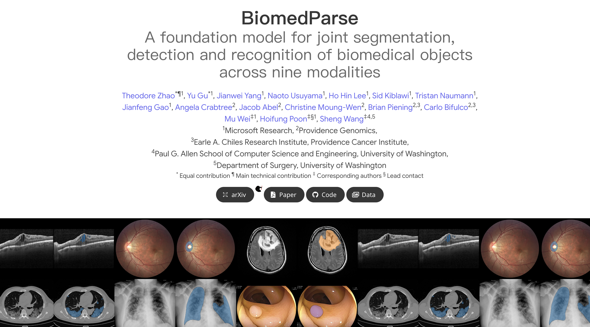

---

#### 6.Show-1 Homepage

- Link: https://github.com/showlab/Show-1/tree/page
- Preview: https://showlab.github.io/Show-1/

    
Screeshot

  
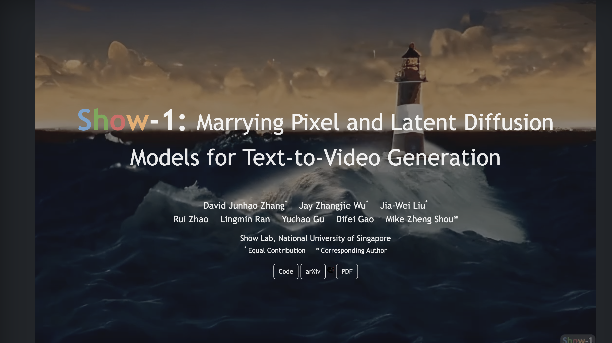

---

#### 7.OLA-VLM Homepage

- Link: None
- Preview: https://praeclarumjj3.github.io/ola_vlm/

    
Screeshot

  
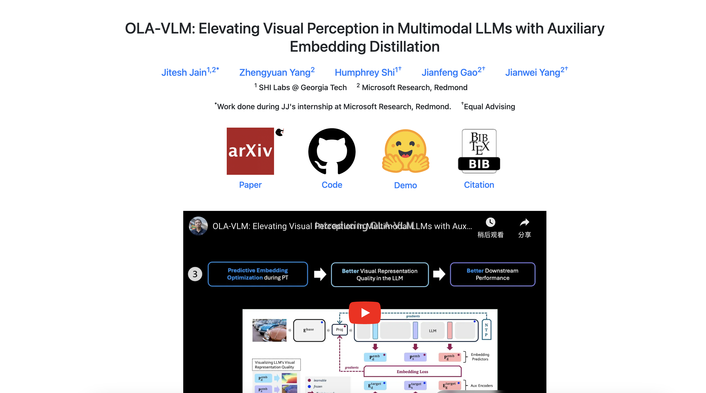

---

#### 8.Video-MME Homepage (Support `splash screen animation`)

- Link: https://video-mme.github.io/
- Preview: https://github.com/Video-MME/video-mme.github.io

    
Screeshot

  
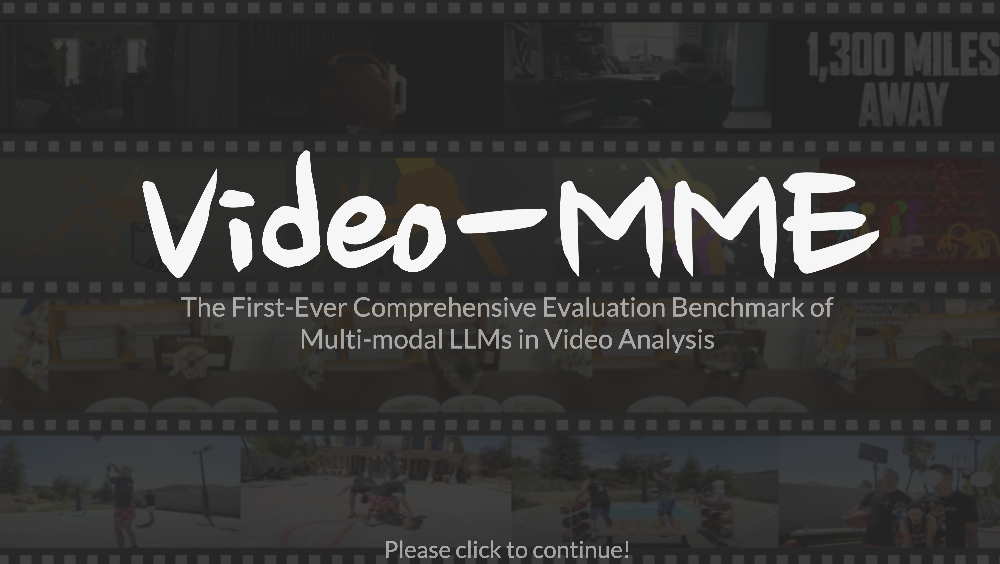

---

#### 9.F5-TTS Homepage

- Link: https://github.com/SWivid/SWivid.github.io/tree/main/F5-TTS
- Preview: https://swivid.github.io/F5-TTS/

    
Screeshot

  
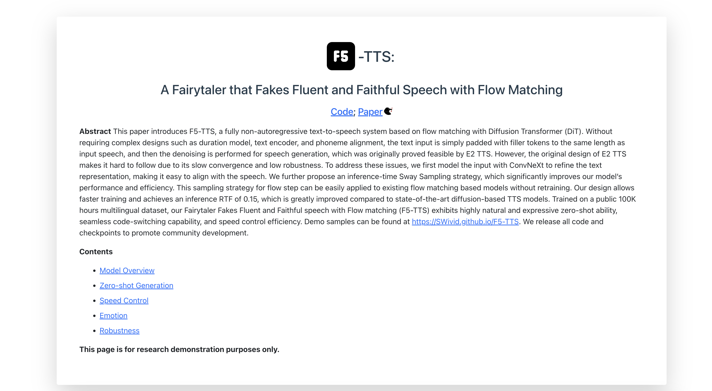

---

#### 10.Genesis Homepage (Support `logo`)

- Link: https://github.com/Genesis-Embodied-AI/genesis-embodied-ai.github.io
- Preview: https://genesis-embodied-ai.github.io/

    
Screeshot

  
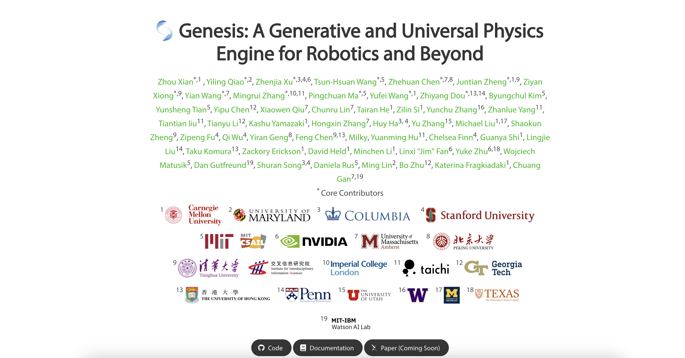

---

#### 11.MLLM Projections Homepage

- Link: https://github.com/claws-lab/projection-in-MLLMs
- Preview: https://claws-lab.github.io/projection-in-MLLMs/

    
Screeshot

  
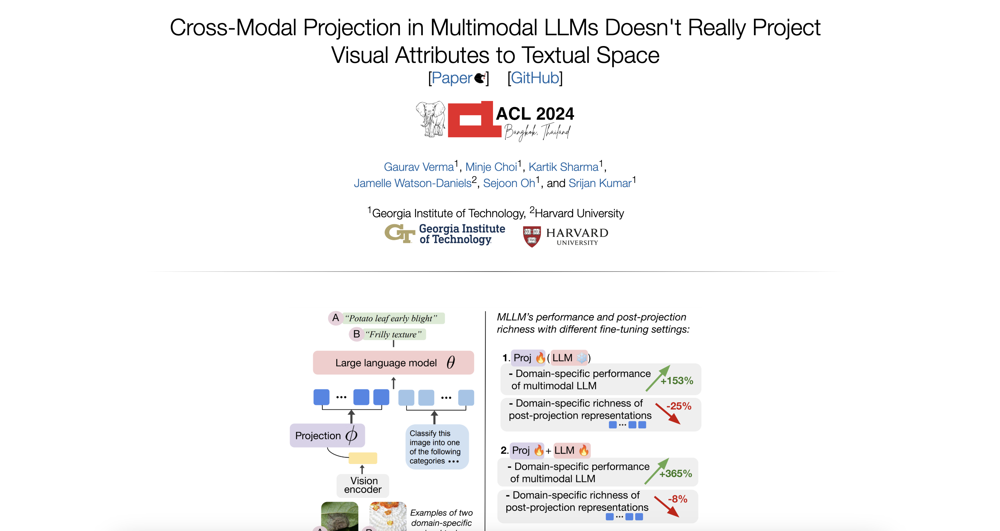

---

#### 12.M3CoT Homepage

- Link: https://github.com/LightChen233/m3cot.github.io
- Preview: https://lightchen233.github.io/m3cot.github.io/

    
Screeshot

  
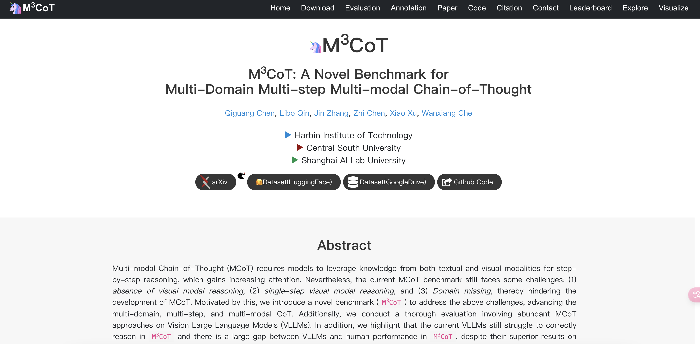

---

#### 13.DecodingTrust Homepage

- Link: https://github.com/DecodingTrust/decodingtrust.github.io
- Preview: https://decodingtrust.github.io/

    
Screeshot

  
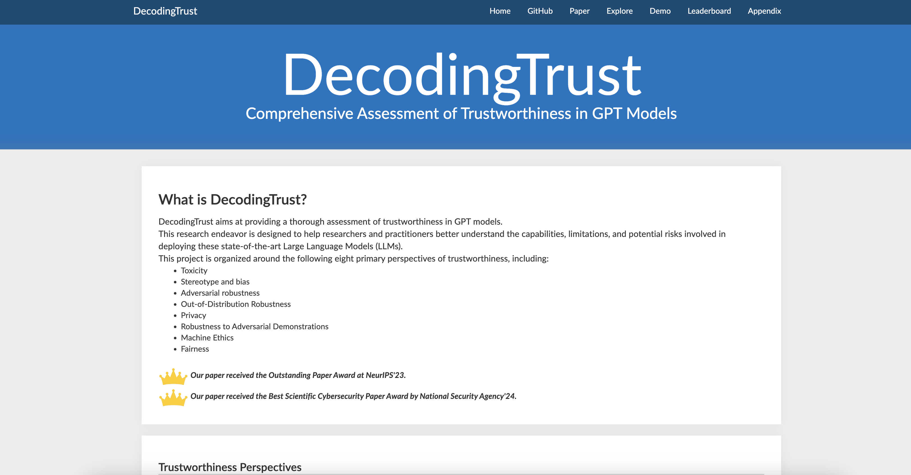

---

#### 14.Magpie Homepage

- Link: https://github.com/magpie-align/magpie-align.github.io
- Preview: https://magpie-align.github.io/index.html

    
Screeshot

  
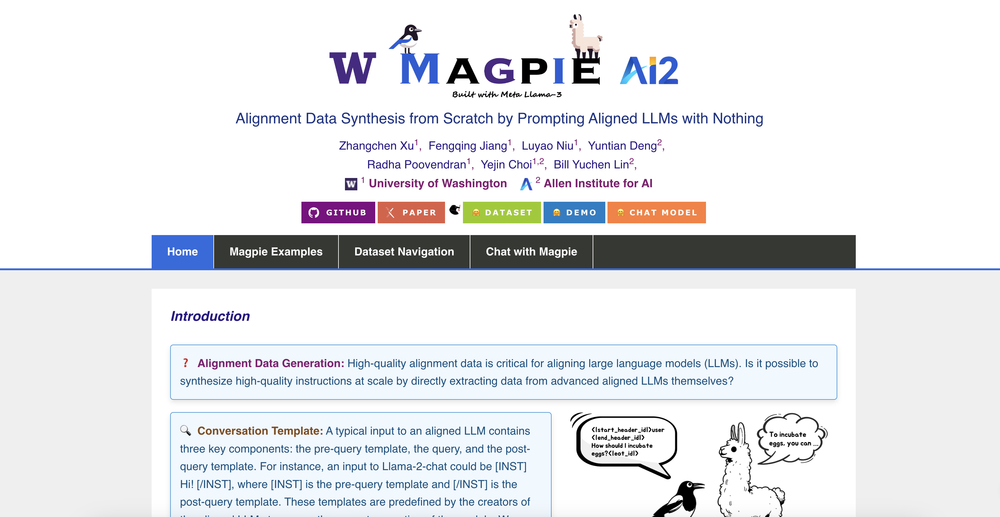

---

#### 15.RAGEN Homepage

- Link: https://github.com/RAGEN-AI/ragen-ai.github.io
- Preview: https://ragen-ai.github.io/

    
Screeshot

  
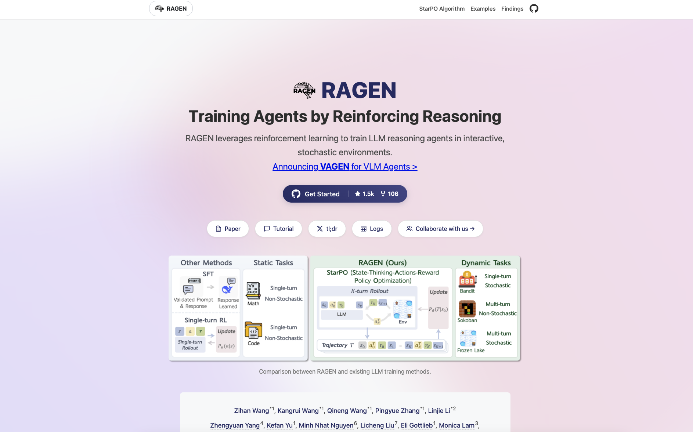

---

#### 16.FlashTex Homepage

- Link: https://github.com/flashtex/flashtex.github.io
- Preview: https://flashtex.github.io/

    
Screeshot

  
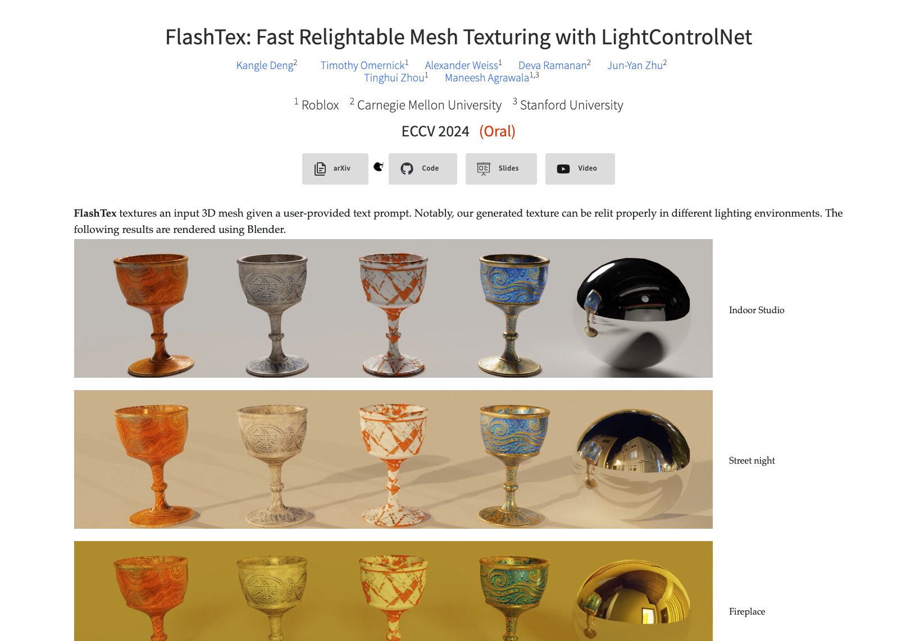

---

#### 17.ScienceBoard Homepage

- Link: https://github.com/QiushiSun/ScienceBoard-Home
- Preview: https://qiushisun.github.io/ScienceBoard-Home/

    
Screeshot

  

---

#### 18.Thinking with Camera Homepage

- Link: https://github.com/KangLiao929/KangLiao929.github.io/tree/main/projects/puffin
- Preview: https://kangliao929.github.io/projects/puffin/

---

#### 19.Academic Project Page Template

- Link: https://github.com/eliahuhorwitz/Academic-project-page-template
- Preview: https://eliahuhorwitz.github.io/Academic-project-page-template/

---

#### 20. Audio Interaction Model

- Preview: https://xzf-thu.github.io/Audio-Interaction/

---

#### 21. SANA-WM

- Preview: https://nvlabs.github.io/Sana/WM/

---

22. https://chordedit.github.io/
23. https://nvlabs.github.io/motionbricks/
24. https://aigeeksgroup.github.io/DragMesh-2/
25. https://siang1105.github.io/JanusMesh.github.io/
26. https://www.nlp.ecei.tohoku.ac.jp/projects/sumi/
27. https://joyai-vl-video-future-academy-jd.github.io/JoyAI-VL-Interaction/
28. https://amap-ml.github.io/DreamX_World/
29. https://haoz19.github.io/world-tracing-page/
30. https://orange-3dv-team.github.io/MoVerse/
31. https://anttwo.github.io/surflo/
32. https://malamatenia.github.io/morphology4metrology-analysis/
33. https://embodied-r.github.io/
34. https://microsoft.github.io/LatentSpatialMemory/
35. https://haowenhou.github.io/AdaCodec-Page/
36. https://aigeeksgroup.github.io/PlatonicNav/
37. https://statefulvisualencoders.github.io/
38. https://research.nvidia.com/labs/lpr/locate-anything/
39. https://xzf-thu.github.io/Mega-ASR/
40. https://mobilegym.dev/
41. https://dexjoco.github.io/
42. https://allenai.github.io/WildDet3D/
43. https://gameworld-project.github.io/
44. https://h-embodvis.github.io/NUMINA/
45. https://weianmao.github.io/tri-attention-project-page/
46. https://void-model.github.io/
47. https://vpo-rl.github.io/
48. https://microsoft.github.io/benchpress/
49. https://dang-ai.github.io/ReMMD/#top
50. https://dagroup-pku.github.io/PhysisForcing.github.io/
51. https://nvidia-isaac.github.io/video_to_data/chord/
52. https://end2end-diffusion.github.io/diffusion-bench/
53. https://bytedance.github.io/safepyramid/
54. https://nvlabs.github.io/neumatex/
55. https://modality-forcing.github.io/
56. https://facebookresearch.github.io/brain2qwerty/
57. https://inspatio.github.io/inspatio-world/
58. https://orca-wm.github.io/
59. https://research.nvidia.com/labs/toronto-ai/difix3d/
60. https://vision-language-kinematics.github.io/
61. https://snuvclab.github.io/HRDexDB/
62. https://anewgithubname.github.io/zeroflow_combined_standalone.html
63. https://haofeixu.github.io/pointdit/
64. https://robodojo-benchmark.com/
65. https://minghaofu.com/tc-wm/
66. https://cells2pixels.github.io/
